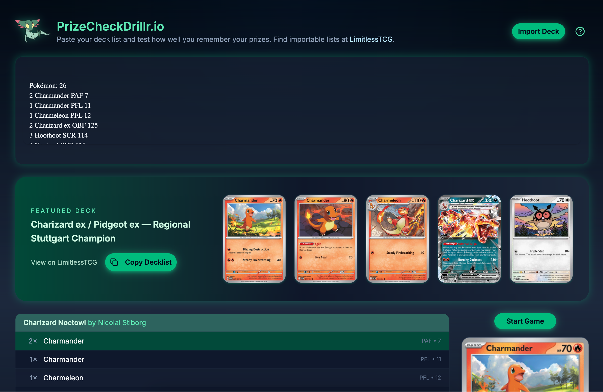

# PrizeCheck.us

Train your Pokémon TCG prize-checking muscle memory.

Paste a deck list, let the app simulate a real game (opening hand + 6 prizes), then see how accurately you can guess what’s prized — while a timer and rank system keep you honest.

> ⚠️ Fan project. Not affiliated with or endorsed by Nintendo, Creatures, GAME FREAK, The Pokémon Company, or LimitlessTCG.

---

## Table of Contents

- [Demo](#demo)
- [Features](#features)
- [How It Works](#how-it-works)
- [Controls](#controls)
- [Tech Stack](#tech-stack)
- [Getting Started](#getting-started)
- [Project Structure](#project-structure)
- [Environment / APIs](#environment--apis)
- [Scoring & Rank System](#scoring--rank-system)
- [Future Ideas](#future-ideas)
- [Credits](#credits)
- [License](#license)

---

## Live demo

### 📷 Screenshots


  


  

---

## Features

### 🧾 Smart deck import

- Paste a **text export** of a deck list (e.g. from LimitlessTCG).
- Parser extracts counts + set codes + card numbers  
  (supports lines like `4 Charmander PAF 7`).
- Calls an internal `/api/cards` endpoint backed by a generated local card index.
- No Pokémon TCG API call is required during normal app use.
- Hydrates cards with:
  - Name
  - Set code
  - Card number
  - Image URL

### ⭐ Featured deck + list view

- A **featured tournament list** can be preloaded on first visit.
- Clean **deck title bar** above the list, e.g.
  - `Charizard Noctowl by Nicolai Stiborg`
- Scrollable list:
  - Zebra-striped rows for readability.
  - Hovering a row updates a **full-card preview** on the right.

### 🃏 Game simulation

- When the user hits **Start Game**:
  - The deck is riffle-shuffled.
  - An 8-card **opening hand** is drawn.
  - 6 cards are set aside as **prize cards**.
- The remaining deck is shown as a **3D-style horizontal carousel**:
  - Center card is slightly larger and glows.
  - Nearby cards fan out with depth and blur.
  - Certain “ex” cards get a subtle **holographic overlay**.

### ⏱️ Timer & HUD

- 2-minute countdown timer (configurable).
- Progress bar that fills as time elapses.
- **Restart** button to re-deal the same 60-card list.
- **Guess Prizes** button to jump to the prize-selection phase.

### 🔍 Prize selection grid

- After time is up (or when you click **Guess Prizes**):
  - All 60 cards appear in a responsive grid.
  - Click any card to select it as a “prize” guess  
    (up to 6 selected at a time).
- Selection overlay shows **current count** (`3/6 Selected`).
- Once 6 are selected, a **Submit Guesses** button appears.

### 📊 Results & ranking

- Results panel shows:
  - Overall **score** (0–1000).
  - **Personal best**, with a “New PB” badge on improvement.
  - Breakdown:
    - ✅ Correct guesses
    - ❌ Wrong guesses
    - 🟧 Missed prizes
    - ⏱️ Time used vs. total time
- **Rank system** with custom crests:
  - Poké Ball → Great Ball → Ultra Ball → Master Ball
  - Progress bar shows % to next rank and change from last game.
- Rank + personal best are stored in `localStorage`.

### ⚡ Local data & micro-interactions

- Pokémon TCG card data is stored locally under `data/pokemon-tcg`.
- A generated `data/generated/card-index.json` keeps cold card lookups fast.
- Subtle hover / press animations on all primary buttons:
  - Slight scale-up on hover.
  - Soft “press” effect on click.
- Loading overlay:
  - Riffle-shuffle GIF + progress bar while importing.
- Pre-game **3-2-1 Poké Ball countdown** overlay.

### 📱 Responsive & keyboard-friendly

- Layout works from laptop → large desktop.
- Fully playable with mouse **or** keyboard.

---

## How It Works

There are three main stages in the app:

1. **Import**
   - User pastes a deck list.
   - App parses IDs and calls `/api/cards`, which reads the generated local card index.
   - Featured deck can auto-load for first-time users.

2. **Game**
   - `dealCards` helper:
     - Shuffles full deck.
     - Draws opening hand.
     - Sets aside 6 prizes.
   - Remaining cards appear in the carousel.
   - User explores the deck and mentally tracks what’s missing.

3. **Results**
   - User selects 6 cards they believe were prizes.
   - App compares guesses vs actual prizes, including duplicates.
   - Score, rank, and summary are displayed.

---

## Controls

**On the carousel (game screen):**

- **Left/Right arrow keys / Mouse wheel**  
  Scroll through the deck.
- **Side arrow buttons**  
  Step exactly one card at a time.
- **Left click / Press A**
  - If card is centered: send it to the **front** of the deck.
  - Otherwise: **center** that card.
- **Right click / Press D**
  - Send card to the **back** of the deck.

**On the prize-selection grid:**

- **Click** a card to toggle selection.
- Max 6 cards can be selected at once.

---

## Tech Stack

- **Framework:** Next.js (App Router, React, TypeScript)
- **UI & styling:**
  - Tailwind CSS
  - shadcn/ui components (`Button`, `Card`, `Badge`, etc.)
  - `lucide-react` icons
- **State & logic:**
  - React hooks (`useState`, `useEffect`, `useMemo`, `useCallback`)
  - Custom card dealing & scoring helpers
- **Storage:**
  - `localStorage` (personal best + rank state)
- **Data:**
  - Local JSON from `PokemonTCG/pokemon-tcg-data`
  - Generated lookup index for fast `/api/cards` hydration
- **Deployment:** Designed for Vercel (but can run anywhere that supports Next.js)

---

## Getting Started

### Prerequisites

- **Node.js** `18+` (preferably `20.x`)
- **npm**

### Setup

```bash
# 1. Clone the repo
git clone https://github.com/<your-username>/<your-repo>.git
cd <your-repo>

# 2. Install dependencies
npm install

# 3. Refresh local Pokémon TCG data from upstream master
npm run refresh:tcg-data

# 4. Verify the generated card index
npm run smoke:data

# 5. Run in development mode
npm run dev

# 6. Open in the browser
# http://localhost:3000
```

### Data updates

Use `npm run refresh:tcg-data` whenever new sets are added upstream. This downloads the current `master` data, rebuilds `data/generated/card-index.json`, and keeps runtime card lookup local and fast.
