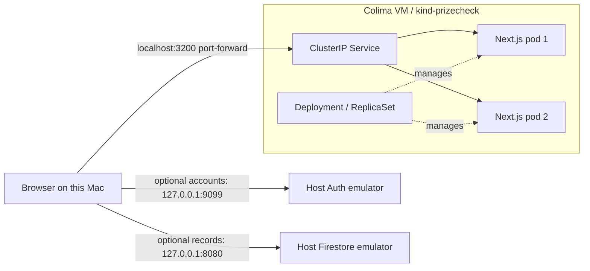

# PrizeCheck: local Docker and Kubernetes lab

This environment runs PrizeCheck locally for learning and portfolio demonstrations. It does not move `www.prizecheck.us` to Kubernetes, deploy Firebase rules, or provision cloud infrastructure. Keep Firebase `prizecheck-f33ad` on Spark with no billing. The app's intended audience remains ages 13+.

For Windows, follow the [Windows/WSL guide](LOCAL-KUBERNETES-WINDOWS.md). The commands below describe the Mac/Colima setup.

## Architecture



The browser Firebase SDK talks directly to emulators on the **browser's** host. The app pods do not connect to Firebase. Guest practice needs neither emulator. Card lookup uses the JSON dataset inside each image; external card image URLs still require network access. This is not a fully air-gapped environment.

Two pods demonstrate scheduling and replacement on one node, not host-level high availability. Losing the Mac, VM, or single control-plane node takes down the entire lab. No ingress controller, public LoadBalancer, registry, persistent volume, cloud credentials, or Kubernetes Secret is needed.

## Baseline and branch isolation (September 10, 2026)

The infrastructure branch `prizecheck/local-infrastructure` is based on production commit `af6ddcffff1f575bc644e371593ae19ea7c65489`. It was prepared in `/private/tmp/prizecheck-local-infrastructure` without switching the original checkout. Only the infrastructure files and focused config/README/CI changes were copied. App UI, Firebase client/rules, dependency lockfile, and existing tests match the production baseline. The initial audit below describes the original checkout, not additional changes included in this branch.

- Read `DATABASE-HANDOFF.md`, `FIREBASE-SETUP.md`, and `PROGRESS-SYNC.md` before implementation. Earlier account-release gates in these files are historical; the handoff's later release notes and user report supersede them.
- `git ls-remote origin HEAD` returned `af6ddcffff1f575bc644e371593ae19ea7c65489`. Fetched `origin/main` for comparison without merging or checking it out.
- Local branch: `prizecheck/preserved-progress-20260910`, HEAD `3e0efe1`. There were 31 modified/deleted tracked paths and additional untracked app/tests/docs. Local content differs from production; the first lab packaged that working tree. The isolated branch now packages the production baseline plus infrastructure only.
- No preexisting Docker/Kubernetes manifests. Existing GitHub Actions already checks TypeScript, unit/data tests, builds Next.js, and runs emulator rules/browser checks.
- Existing `.env*`, emulator logs/state, browser reports, and dependency folders are ignored by Git. `.dockerignore` now uses an allowlist, excluding environment files even from intermediate build layers. Do not put credentials in source/public folders.
- Node requirement is `>=22.12.0`; lockfile build resolved Next.js 16.3.4. This Dockerfile uses Node 22 on Debian Bookworm. The runtime contains standalone output, public/static assets, and the generated card index.
- Existing mobile import code retains its 350 ms pause, 800 ms animation, reduced-motion branch, and user-interaction cancellation. No UI/account logic was edited for this lab.
- Initially no working container CLI/runtime, kind, or kubectl. Homebrew recorded Docker Desktop, but `/Applications/Docker.app` was empty. Java 21 was available only at the existing temporary path documented below.

## Tools, compatibility, and cost

Verified on Apple Silicon macOS: Colima 0.10.3, Docker CLI 29.7.2, buildx 0.36.1, kind 0.32.0, kubectl 1.36.4, Kubernetes node 1.36.1. The kubectl/server minor versions match. Node images and kind support ARM64. The Linux AMD64 image build and runtime smoke checks also passed on GitHub Actions; see the linked runs in the results document.

Colima is MIT licensed; Docker CLI and kind are open-source tools. This local route needs no subscription, cloud login, or billing account. [Colima installation](https://colima.run/docs/installation/) and [license](https://github.com/abiosoft/colima/blob/main/LICENSE) explain the selected runtime. Docker Desktop is an alternative subject to its [license eligibility](https://docs.docker.com/desktop/setup/install/mac-install/); it is not used here.

One-time Mac installation (writes outside the repository):

```sh
brew install colima docker docker-buildx kind kubectl
```

Start a dedicated VM, then select it **for this shell**:

```sh
colima start prizecheck --cpu 4 --memory 6 --disk 30 --runtime docker --vm-type vz
export DOCKER_CONTEXT=colima-prizecheck
docker version
```

Colima may also change Docker's current context on first startup; `kind create cluster` sets kubectl's current context. The scripts explicitly target `kind-prizecheck` for every kubectl operation. Keep `DOCKER_CONTEXT` set when using kind so it finds the same VM. Inspect your previous context before switching back to other work.

Homebrew's buildx plugin may not be auto-discovered. The commands below call it directly, avoiding changes to `~/.docker/config.json`. On other installations with working `docker buildx`, use `docker buildx build --load` instead.

## Build and run Docker

From the repository root:

```sh
export DOCKER_CONTEXT=colima-prizecheck
"$(brew --prefix)/lib/docker/cli-plugins/docker-buildx" build --load -t prizecheck:local-v1 .
docker run -d --name prizecheck-local -p 127.0.0.1:3100:3000 prizecheck:local-v1
node scripts/container-smoke.mjs http://127.0.0.1:3100
docker exec prizecheck-local id
docker inspect prizecheck-local --format '{{.State.Health.Status}}'
```

Open [local Docker app](http://localhost:3100). The image's health check takes a few seconds to report healthy. Container name conflicts mean an earlier instance exists: inspect it, then `docker stop prizecheck-local` / `docker rm prizecheck-local` before creating its replacement.

### Build-time versus runtime configuration

`NEXT_PUBLIC_*` values are compiled into browser JavaScript by Next.js. Changing Kubernetes environment variables does **not** rewrite them. This Dockerfile deliberately fixes `NEXT_PUBLIC_FIREBASE_USE_EMULATORS=true` and `VERCEL_ENV=local` during build; it exposes no production Firebase build arguments. The existing Firebase client then uses `demo-prizecheck` and `demo-key`, regardless of live public web settings elsewhere in the checkout. Never copy `.env.local`, mount it into this lab, or pass an Admin/service-account key to a build.

`PRIZECHECK_STANDALONE=true` opts into standalone output only for this image. The two-line addition to `next.config.mjs` preserves the existing hosted production/preview behavior when that flag is absent. This flag is server build configuration, not a browser variable.

`deploy/local.yaml` contains a ConfigMap for actual runtime settings (`PORT`, `HOSTNAME`, `NODE_ENV`, telemetry). After a ConfigMap change, run `kubectl --context kind-prizecheck -n prizecheck-local rollout restart deployment/prizecheck`; environment values are read when pods start. A browser configuration change requires a new image, loading it into kind, and updating the Deployment's image.

The Node base tag receives updates; it is not digest-pinned. Rebuild and reverify when updating dependencies/base images. Use distinct tags such as `local-v2` for subsequent builds instead of silently overwriting a running tag.

## Start Kubernetes and access the app

```sh
export DOCKER_CONTEXT=colima-prizecheck
bash scripts/local-k8s.sh start
bash scripts/local-k8s.sh status
bash scripts/local-k8s.sh access
```

Keep the last command running and open [local Kubernetes app](http://localhost:3200). In another terminal:

```sh
node scripts/container-smoke.mjs http://127.0.0.1:3200
```

`start` creates the named cluster if missing, loads `prizecheck:local-v1`, applies the namespace/ConfigMap/Deployment/Service, and waits for rollout. Re-running it reapplies the checked-in baseline; use `resume` if you only stopped the pods. `imagePullPolicy: Never` makes a missing image a visible local error and avoids accidental registry pulls.

Pods run as UID/GID 1000 with no service-account token, no added capabilities, no privilege escalation, and a read-only root filesystem. Bounded writable temporary/cache volumes accommodate runtime writes. Each pod requests 100m CPU/128 MiB RAM and is limited to 1 CPU/512 MiB. These are initial lab values, not capacity-planning or load-test results.

Startup probes allow up to roughly 60 seconds to initialize. Readiness removes an unhealthy pod from Service endpoints; liveness restarts an unresponsive process. `/api/health` checks application process health and intentionally avoids Firebase. It does not validate the dataset or every user flow; the separate smoke check validates assets and card lookups. Kubernetes uses its probes instead of the image's Docker HEALTHCHECK.

## Optional Firebase emulators and tests

Host dependencies: `npm ci` and Java 21. No Firebase login is required.

```sh
npm run check
npm run check:rules
# After rules checks finish, start fresh emulators for interactive/browser use:
npm run emulators
```

If using the already present temporary Java installation on this Mac:

```sh
export JAVA_HOME=/private/tmp/prizecheck-java21/Contents/Home
export PATH="$JAVA_HOME/bin:$PATH"
```

That path is not durable; a permanent Java 21 runtime is needed after it disappears. Default ports are Auth 9099, Firestore 8080, and UI 4000. Use fictional accounts. Data is ephemeral unless deliberately exported to an ignored location. Rules tests clear demo data: run them before browser tests, never concurrently with browser practice against the same emulators.

With the Docker container on port 3100, existing Playwright config reuses that server:

```sh
npx playwright install chromium
FIREBASE_E2E=false npm run test:e2e -- --workers=2
# Only after starting the demo emulators on the standard ports:
FIREBASE_E2E=true npm run test:e2e -- --workers=2
```

Do not set `CI=true` in these local commands: the existing Playwright setup would try to start another server on port 3100. The browser must run on this Mac for the fixed loopback emulator URLs; a phone browsing the Mac's LAN address would point to the phone's own loopback. Remote browser testing requires a separately designed emulator configuration.

## Fully isolated container account verification

This is the preferred automated account check when host emulator ports are occupied:

```sh
export DOCKER_CONTEXT=colima-prizecheck
"$(brew --prefix)/lib/docker/cli-plugins/docker-buildx" build --load -t prizecheck:infra-review .
bash scripts/verify-container-accounts.sh prizecheck:infra-review
```

The script builds a test-only image containing the locked npm dependencies, Playwright 1.63.0 browsers, and Java 21. It starts a disposable app container and runs the test runner with `--network container:APP_ID`. The browser and emulators therefore share the app's loopback network, with no published host ports. The existing client can use 8080/9099 unchanged, and host emulator data is never accessed. No host credentials, Docker socket, or environment files are mounted.

The test runner executes TypeScript/unit/data checks, then starts `demo-prizecheck` emulators, runs rules tests, an HTTP smoke check, and the complete existing desktop/mobile browser suite sequentially. `playwright.container.config.ts` disables source-server startup, targets the already running image on port 3000, and sets zero retries so failures remain visible. Account creation, saved decks, deletion, and offline recovery use synthetic demo users only. This does not validate real Google OAuth.

Both disposable containers are removed on exit. The script prints a temporary results directory containing the verification log and Playwright artifacts. Test images stay cached for reuse. Keep the test-image version aligned with the lockfile when upgrading Playwright. This image runs trusted project tests as root (Playwright's supported testing mode); the application image still runs as non-root. The runner needs internet access to download emulator binaries and load the emulator OAuth helper, but requires no Firebase login or billing.

See [Playwright's Docker guidance](https://playwright.dev/docs/docker) and [Docker network sharing](https://docs.docker.com/engine/network/). For cleanup of the cached test image only: `docker image rm prizecheck:account-tests`.

## Reliability exercise

```sh
bash scripts/verify-local-k8s.sh
```

The script deletes one app pod and waits for replacement; changes a pod-template annotation to create a new ReplicaSet; sets an intentionally absent local image; confirms the rollout times out while two working replicas remain available; then uses `rollout undo` to restore the recorded working revision. An exit trap attempts rollback if the failed-image exercise is interrupted. Inspect `status` after any interruption.

Rolling updates use `maxUnavailable: 0`, `maxSurge: 1`, and a five-second readiness settling period. The 25-second failure wait is deliberately shorter than the 120-second Deployment progress deadline. The template update uses the same application image; it is a rollout mechanics exercise, not a second application release.

After pod replacement or rollout, restart `bash scripts/local-k8s.sh access`. `kubectl port-forward service/...` selects one pod and does not automatically reconnect when that pod goes away. Its disconnection is not proof the Service failed. Check in-cluster access separately:

```sh
kubectl --context kind-prizecheck -n prizecheck-local exec deployment/prizecheck -- node -e "fetch('http://prizecheck:3000/api/health').then(async r=>console.log(r.status,await r.text()))"
```

## Stop, resume, and cleanup

```sh
# Stop only the app; keep the cluster and images:
bash scripts/local-k8s.sh stop
bash scripts/local-k8s.sh resume

# Stop the separate Docker app:
docker --context colima-prizecheck stop prizecheck-local
# Restart it later:
docker --context colima-prizecheck start prizecheck-local

# Remove only this lab's cluster and standalone app:
DOCKER_CONTEXT=colima-prizecheck bash scripts/local-k8s.sh cleanup
docker --context colima-prizecheck rm -f prizecheck-local

# Stop the dedicated VM to release CPU/RAM; start it again with colima start prizecheck:
colima stop prizecheck
# Optional full removal, including all images stored in this dedicated VM:
colima delete prizecheck
```

Stop port-forward and emulator terminals with Ctrl-C. Do not run a global Docker prune or delete other clusters. No cloud cleanup is necessary.

## Troubleshooting

| Symptom | Inspect / response |
| --- | --- |
| Cannot reach Docker | `colima status prizecheck`; confirm `DOCKER_CONTEXT=colima-prizecheck`; start that VM. |
| `buildx` missing | Use the Homebrew plugin path shown above; don't overwrite existing Docker config. |
| `ErrImageNeverPull` | Check the image tag; `kind load docker-image TAG --name prizecheck` in the correct Docker context. |
| Pod Pending | `kubectl --context kind-prizecheck -n prizecheck-local describe pod POD`; inspect resource pressure/events. |
| CrashLoopBackOff / failed probe | Inspect `logs POD --previous` and `describe pod POD`; check port and health path. |
| OOMKilled | Inspect pod termination reason and workload; measure before raising the 512 MiB limit. No metrics server is installed. |
| Page works, cards fail | Run the smoke script; verify `/app/data/generated/card-index.json` exists in the image. |
| Port-forward disconnects | Reconnect after pod replacement; separately check Service endpoints and in-cluster HTTP. |
| Account saving unavailable | Verify host emulators on 8080/9099 and use the Mac browser. Rebuild if browser settings changed; ConfigMap won't change compiled JS. |
| Emulator port occupied | Inspect `lsof -nP -iTCP:8080 -sTCP:LISTEN`. Do not stop unknown processes or reset someone else's demo data. Resolve ownership before using default-port account tests. |
| Browser launch fails | Install the Chromium revision for the checked-out Playwright version. |

Useful read-only commands (always specify the local context):

```sh
kubectl --context kind-prizecheck -n prizecheck-local get events --sort-by=.lastTimestamp
kubectl --context kind-prizecheck -n prizecheck-local logs deployment/prizecheck --tail=50
kubectl --context kind-prizecheck -n prizecheck-local get endpointslices
kubectl --context kind-prizecheck -n prizecheck-local rollout history deployment/prizecheck
```

## CI and scope of this change

The new `container` job in `.github/workflows/ci.yml` builds and loads the image, verifies UID 1000 and the application smoke check, captures failure logs, and removes its container. It never pushes an image or deploys anything. The existing unit/rules/browser job remains intact. Standard runners in public repositories are free; private-repository runs consume plan allowances. The feature branch was published as draft PR #3, and both push and PR runs passed. The container job smoke-tests the image; the separate verification job runs browser tests against a source build. No paid runner, registry publishing, or billing setting was used. See [GitHub Actions billing](https://docs.github.com/en/billing/concepts/product-billing/github-actions).

The isolated branch contains infrastructure and its test harness only. The original checkout still contains unrelated app work; do not publish it wholesale. [PR #3](https://github.com/capisz/pokemon-tcg-prize-checker/pull/3) merged this work into `main` as `1446828ecbd10431d55170014182442bb584cd5e`, with successful [PR CI](https://github.com/capisz/pokemon-tcg-prize-checker/actions/runs/34555318159) and [push CI](https://github.com/capisz/pokemon-tcg-prize-checker/actions/runs/34555304132) for code commit `6bbc89b`. The branch-specific Vercel rule below disables its automatic Git deployments. Keep production merging/deployment separate.

Helm is deferred: one local Deployment and Service do not yet justify templating. Consider it after there are multiple intentional environments or repeated configuration variants; retain the plain manifests as the learning baseline.

## Official references

- [Next.js standalone output and asset copying](https://nextjs.org/docs/app/api-reference/config/next-config-js/output)
- [Next.js public build-time variables](https://nextjs.org/docs/app/guides/environment-variables)
- [kind installation, image loading, cluster deletion](https://kind.sigs.k8s.io/docs/user/quick-start/)
- [Kubernetes probes](https://kubernetes.io/docs/tasks/configure-pod-container/configure-liveness-readiness-probes/)
- [kubectl version compatibility](https://kubernetes.io/releases/version-skew-policy/)
- [Firebase emulator configuration](https://firebase.google.com/docs/emulator-suite/install_and_configure)

See [verified results and portfolio wording](LOCAL-KUBERNETES-RESULTS.md) for what was actually tested and the remaining limitations.

## Infrastructure branch publication

`vercel.json` disables automatic Git deployments for `prizecheck/local-infrastructure` and the follow-up documentation branch `prizecheck/windows-wsl-docs`, using Vercel's [branch-specific deployment configuration](https://vercel.com/docs/project-configuration/git-configuration#git.deploymentenabled). Unspecified branches retain their default behavior. This allows GitHub CI review without a hosted preview; it does not disable production deployments from `main` or change live project settings. Merging remains a separate production decision.
